# Home Pc Hub

Windows system tray app for TP-Link Tapo plugs, power strips, and bulbs - discover on your LAN, save a free-form device list, and control everything locally.

| Language | Jump |
|----------|------|
| **English** | [Read in English](#english) |
| **Türkçe** | [Türkçe oku](#türkçe) |

**Local-only control** via [python-kasa](https://github.com/python-kasa/python-kasa). Your Tapo account authenticates devices on your network; credentials and settings stay on this PC (`%APPDATA%\HomePcHub\`).

Unofficial client - not affiliated with TP-Link.

---

<a id="english"></a>

## English

### What it is

Home Pc Hub runs in the Windows tray. You scan for Tapo devices, build your own list, toggle power quickly from a flyout, open detailed panels for lights, plugs, and schedules, and use **Automation** for shortcuts, scenes, and notification-driven rules.

### Screenshots

**Full settings** - device list, **Bulb ▾** mini menu under the title, language & theme, LAN scan (Scan / Add selected always visible):

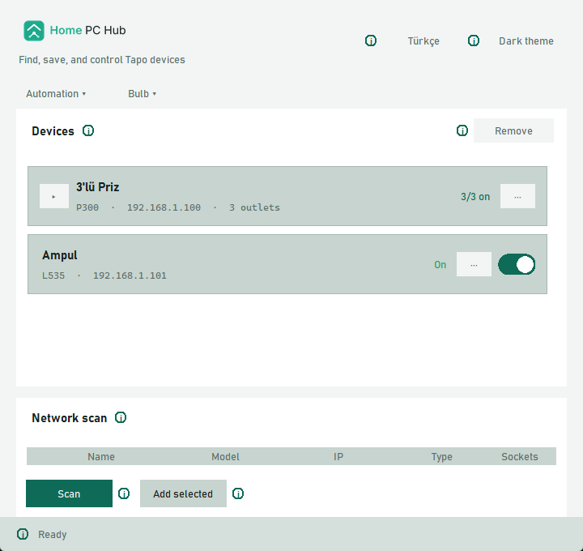

**Edit ambient modes** - open via **Bulb ▾ → Edit ambient modes…**: Kelvin/brightness, custom modes, and **linked actions** (other bulb same mode / plug on-off):

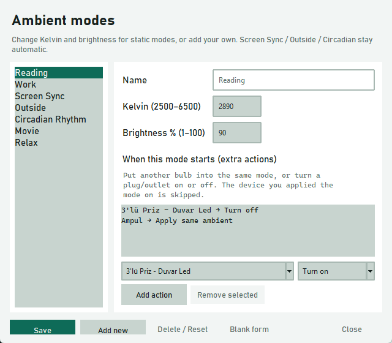

**Schedule** - from plug/outlet **··· → Schedule…**: timed tab with aligned Type / Time / Action fields and themed tabs:

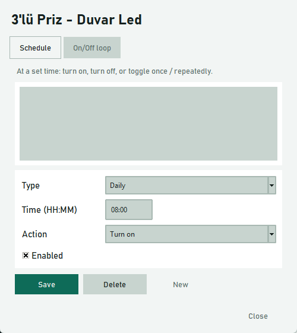

**Shortcuts** - **Automation ▾ → Shortcuts…**: click a row and press the combo:

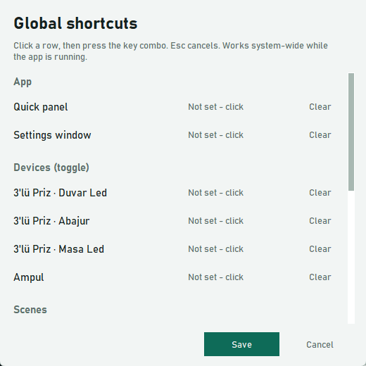

**Scenes** - **Automation ▾ → Scenes…**: ordered multi-device steps + wait:

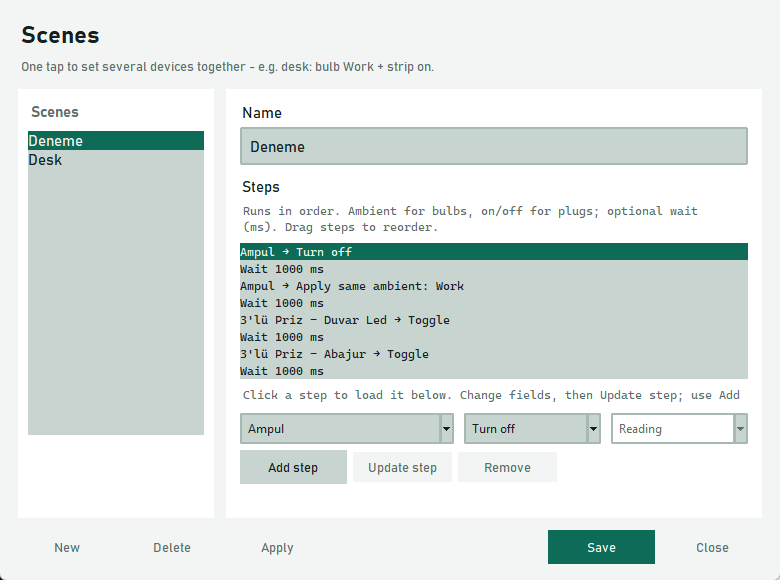

**Notifications** - **Automation ▾ → Notifications…**: toast rules with app filter and device steps:

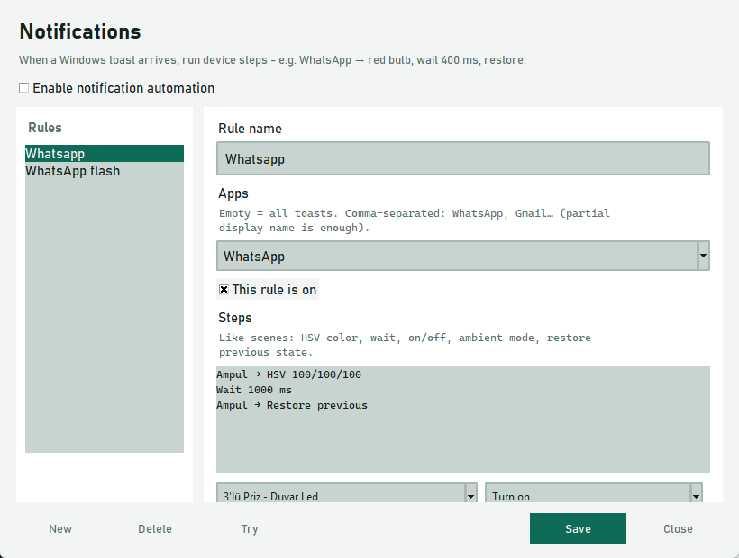

**Tray flyout** - single-click tray: separators between outlets/devices, ambient **dropdown** + **(i)** tip:


> Screenshots captured live in English UI via Pillow `ImageGrab`.

### Requirements

- Windows
- Python 3.11+
- Devices already set up in the official Tapo app (same account)
- Optional packages from `requirements.txt`: `keyboard` (global shortcuts), `winsdk` (Windows toast → device rules). Grant **notification access** in Windows Settings if you use Notifications.

### Setup

```bash
python -m venv .venv
.venv\Scripts\pip install -r requirements.txt
.venv\Scripts\python -m homepchub
```

Or: `.venv\Scripts\python tray_app.py`

First launch asks for Tapo email/password. Saved under `%APPDATA%\HomePcHub\config.json` (never committed) with devices, theme, language, schedules, scenes, hotkeys, notification rules, and aliases.

Only **one** tray instance should run (a single-instance lock prevents a second copy from starting).

---

### The “···” button (more / details)

In the device list, **···** is the **details** button next to a device or outlet. It is not an ellipsis for truncated text - it opens a panel with everything beyond a simple on/off switch.

| Where you click **···** | What opens |
|-------------------------|------------|
| **Bulb** row | **Light panel** - rename, power, ambient modes, brightness, color temperature (K), color wheel / HSV |
| **Single plug** row | **Feature panel** - rename, energy and other reported features, **Schedule…** |
| **Power strip header** | **Device-level feature panel** - strip-wide options (e.g. LED), not one outlet |
| **One outlet** on a strip | **Outlet feature panel** - that socket’s features + **Schedule…** for that outlet |
| Inside the **light panel** (top-right **···**) | **Device details** for the bulb (signal, firmware, connection info, etc.) |

From a plug/outlet feature panel, **Schedule…** opens the schedule editor (timed rules + on/off loop).

---

### Features

#### System tray

- Closing the settings window keeps the app in the tray.
- **Single-click** tray icon → **quick panel (flyout)**: power toggles for every saved device/outlet; **dividers** between devices (and between strip outlets); bulbs also get an **ambient mode** dropdown.
- **Double-click** → full settings window.
- Menu: settings, quick panel, exit.
- Tray icon and window icon use the Home PC Hub brand mark.
#### Automation (header **Automation ▾**)

Three editors live under the title bar menu:

| Menu | Opens |
|------|--------|
| **Shortcuts…** | Global hotkeys |
| **Scenes…** | Named multi-device recipes |
| **Notifications…** | Rules that run when a Windows toast arrives |

##### Shortcuts…

- Click a row, then **press** the key combo (Esc cancels). Works system-wide while the app is running (`keyboard` package).
- Sections: **App** (quick panel / settings window), **Devices (toggle)**, **Scenes**, **Bulb ambient modes**.
- Default flyout shortcut: `ctrl+shift+h`.
- Same combo on several devices/outlets → conflict dialog: **Cancel** or **Share** (run each target’s own toggle in order).

##### Scenes…

- Named one-tap recipes (e.g. desk: bulb → Work + strip on). Buttons appear on the tray flyout.
- Ordered **steps**: ambient mode / on / off / toggle, plus optional **wait (ms)**. Drag to reorder; click a step → edit fields → **Update step** (or **Add step** for a new one). Consecutive duplicate device steps are blocked (waits ignored).

##### Notifications…

- When a Windows toast arrives, run device steps (needs `winsdk` + Windows notification access).
- Toggle **Enable notification automation**; each **rule** has a name, optional **Apps** filter (empty = all toasts; comma-separated partial display names, e.g. `WhatsApp, Gmail`), and ordered steps.
- Steps (like scenes): **Color (HSV)**, wait, on/off/toggle, ambient mode, **Restore previous** (snapshot before mutate, then restore). **Try** runs the saved rule once without waiting for a toast.

#### Device discovery & list

- **Scan** the LAN (strips show socket count).
- **Add selected** to your list (unlimited).
- Scan **Scan** / **Add selected** buttons stay visible (reserved layout; window sized so they are not clipped).
- Scrollable list with a **theme-colored scrollbar** (not the harsh system bar).
- Strips **expand / collapse**.
- Power state refreshes while the window or flyout is open; power actions stay responsive (per-host I/O, status refresh paused while a command is in flight).
- Prefer DHCP reservations so saved IPs stay reachable.

#### Plugs & strips

- Toggle power per plug or per outlet.
- Rename plugs and outlets (alias stored locally).
- Feature panels show what the device reports (energy, LED, etc.).

#### Bulbs / lights

- Toggle on the main list; full control via **···** → light panel.
- Brightness, Kelvin white, HSV color (wheel + sliders).
- Rename from the light panel.
- **Ambient modes** as a **dropdown** (light panel + flyout), with an **(i)** tip listing what each mode does:

| Mode | Behavior |
|------|----------|
| **Reading** | Warm static scene for reading (Kelvin / brightness editable) |
| **Work** | Cooler / brighter static scene (editable) |
| **Relax** | Soft static scene (editable) |
| **Movie** | Very dim warm bias light (editable) |
| **Circadian** | Kelvin & brightness follow local time of day (updates in the background) |
| **Outside** | Color from local weather + time (needs network; open-meteo) |
| **Screen Sync** | Matches average color of a **chosen** monitor (~1/s); pick display + **Identify** (big numbers) + min-brightness boost in the light panel (choice is remembered) |
| **Your custom modes** | Name + Kelvin + brightness; appear in the same dropdown |

Switching modes stops the previous dynamic mode (circadian / outside / screen sync). Music mode is not included yet.

##### Edit ambient modes (header **Bulb ▾** menu)

If you have at least one bulb saved, the main window shows a mini **Bulb ▾** control under the title. **Edit ambient modes…** opens an editor where you can:

- Change Kelvin / brightness for Reading, Work, Movie, Relax (or reset to defaults).
- **Add** custom static modes and **delete** them.
- Attach **linked actions** that run when that mode is applied: put **another bulb** into the **same ambient**, or **on / off / toggle** a plug or strip outlet. The device you applied the mode on is skipped so it does not loop.

Settings live in local config under `presets` (overrides, custom modes, actions).

#### Schedules & loops

Open **Schedule…** from a plug/outlet feature panel. The app must be running for rules to fire.

| Tab | What it does |
|-----|----------------|
| **Timed** | Once / daily / weekly / monthly / yearly at a clock time - **on / off / toggle**. Extra fields (date, weekdays, day of month, …) appear only for the selected kind; labels and inputs stay aligned. |
| **On/off loop** | Repeat: N minutes on, M minutes off |

Theme-colored tab chrome (no bright system notebook border). Stored in local config; polled about every **~20 seconds** (not second-precise).

#### Language, theme, chrome

- UI **Türkçe** or **English** (header toggle; saved).
- **Light / dark** theme aligned to brand colors (saved). Light mode uses **darker** control fills so buttons/inputs stand out on white surfaces.
- Theme changes apply without flicker when you interact with the window (no stacked title-bar handlers / clam reset flash).
- Windows title bar (min / max / close) follows the theme colors on supported Windows builds.
- Network scan list and similar widgets use **theme borders** instead of stark white system frames.
- Inline **(i)** help tips on many controls (including ambient modes).
- Dialogs (bulb / plug / schedule) size to the screen with scrollable bodies and fixed footers so action buttons stay reachable.
- Header and flyout show the brand logo.

#### Privacy

- Control stays on your LAN via python-kasa.
- Credentials are only for device auth; this app does not upload your data.
- Config: `%APPDATA%\HomePcHub\config.json`.

### Project layout

```
homepchub/
  assets/     tray/app icons, logos (brand pack subset)
  core/       config, devices (python-kasa), scheduler, hotkeys, scenes, notifications, ambient presets (+ store)
  i18n/       TR/EN strings and feature labels
  ui/         tray, window, flyout, bulb/plug/schedule/preset/hotkey/scene/notify panels, theme, chrome
tray_app.py   thin entry (same as python -m homepchub)
```

### License

MIT - see [LICENSE](LICENSE).

---

<a id="türkçe"></a>

## Türkçe

### Nedir?

Home Pc Hub, Windows tepsi uygulamasıdır. Tapo cihazlarını ağda bulur, kendi listeni oluşturursun; flyout’tan hızlı aç-kapa, ayar penceresinden ışık / priz / zamanlama detaylarını yönetirsin. **Otomasyon** ile kısayol, sahne ve bildirim kurallarını ayarlarsın.

### Ekran görüntüleri

**Tam ayarlar** - cihaz listesi, başlık altında **Ampul ▾** mini menü, dil & tema, ağ tarama (Tara / Seçilenleri ekle görünür):

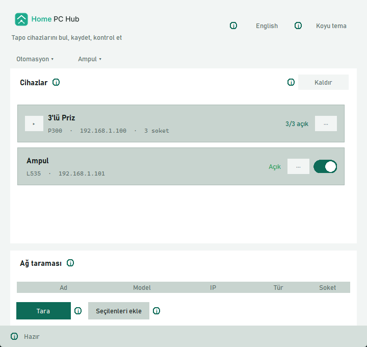

**Ortam modlarını düzenle** - **Ampul ▾ → Ortam modlarını düzenle…**: Kelvin/parlaklık, özel modlar ve **ek aksiyonlar** (başka ampul aynı moda / priz aç-kapa):

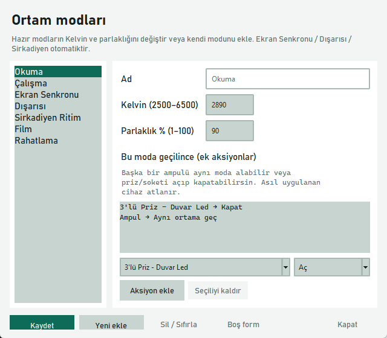

**Zamanlama** - priz/soket **··· → Zamanlama…**: hizalı Tür / Saat / İşlem alanları ve temalı sekmeler:

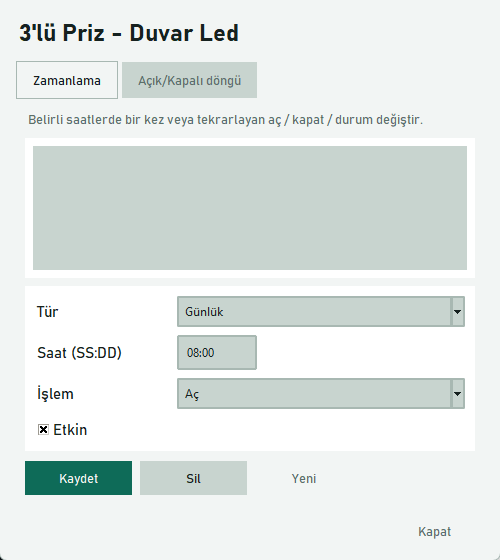

**Kısayollar** - **Otomasyon ▾ → Kısayollar…**: satıra tıkla, kombinasyonu bas:

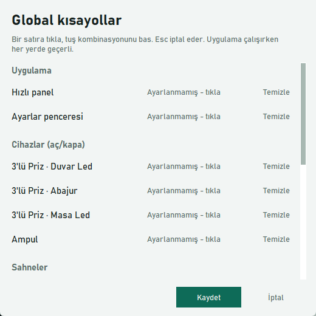

**Sahneler** - **Otomasyon ▾ → Sahneler…**: sıralı çoklu cihaz adımları + bekleme:

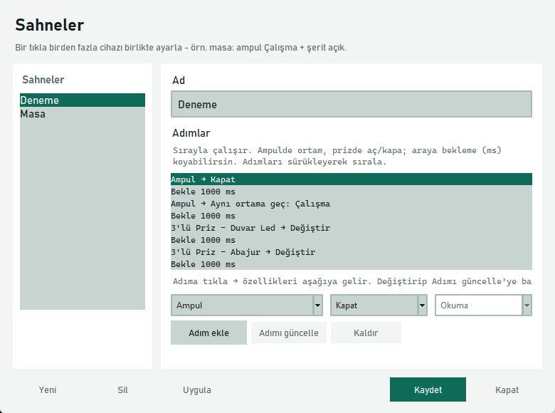

**Bildirimler** - **Otomasyon ▾ → Bildirimler…**: toast kuralları, uygulama filtresi ve cihaz adımları:

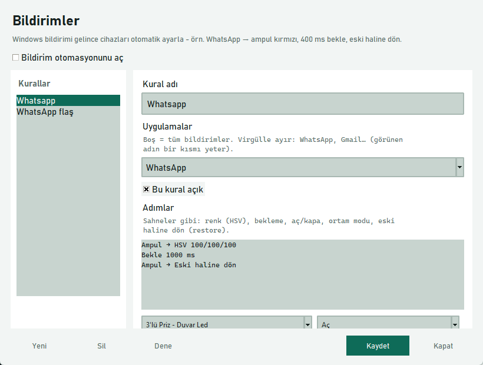

**Tepsi flyout** - tek tık: cihaz/soket ayırıcıları, ortam **dropdown** + **(i)** ipucu:

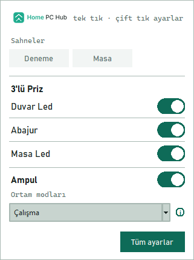

> Görseller Türkçe arayüzde canlı alındı (Pillow `ImageGrab`).

### Gereksinimler

- Windows
- Python 3.11+
- Resmi Tapo uygulamasında aynı hesapla kurulmuş cihazlar
- `requirements.txt` içinden: `keyboard` (global kısayollar), `winsdk` (Windows bildirimi → cihaz kuralları). Bildirimler için Windows Ayarlar’da **bildirim erişimi** vermen gerekir.

### Kurulum

```bash
python -m venv .venv
.venv\Scripts\pip install -r requirements.txt
.venv\Scripts\python -m homepchub
```

Alternatif: `.venv\Scripts\python tray_app.py`

İlk açılışta Tapo e-posta/şifre istenir. Cihazlar, tema, dil, zamanlamalar, sahneler, kısayollar, bildirim kuralları ve isimlerle birlikte `%APPDATA%\HomePcHub\config.json` içinde saklanır (repoya girmez).

Aynı anda **tek** tepsi örneği çalışmalı (ikinci kopya açılmaz).

---

### “···” düğmesi nedir? (detay / daha fazla)

Cihaz listesindeki **···**, metin kesme işareti değil - **detay / daha fazla** düğmesidir. Basit aç-kapadan fazlasını (ışık ayarları, özellikler, zamanlama) açar.

| Nerede **···**’ye basarsın? | Ne açılır? |
|-----------------------------|------------|
| **Ampul** satırı | **Işık paneli** - yeniden adlandırma, güç, ortam modları, parlaklık, renk sıcaklığı (K), renk tekerleği / HSV |
| **Tekli priz** satırı | **Özellik paneli** - yeniden adlandırma, enerji ve cihazın bildirdiği özellikler, **Zamanlama…** |
| **Şerit başlığı** | **Cihaz seviyesi özellik paneli** - şeridin geneli (ör. LED); tek soket değil |
| **Şeritteki bir soket** | **Soket özellik paneli** - o çıkışın özellikleri + o soket için **Zamanlama…** |
| **Işık panelinin** sağ üstündeki **···** | Ampulün **cihaz detayları** (sinyal, yazılım, bağlantı vb.) |

Priz/soket özellik panelindeki **Zamanlama…**, zamanlı kurallar + açık/kapalı döngü editörünü açar.

---

### Özellikler

#### Sistem tepsisi

- Ayar penceresini kapatsan da uygulama tepside kalır.
- **Tek tık** → **hızlı panel (flyout)**: tüm cihaz/soket aç-kapa; cihazlar (ve şerit soketleri) arasında **ayırıcı çizgiler**; ampullerde **ortam modu** dropdown.
- **Çift tık** → tam ayar penceresi.
- Menü: ayarlar, hızlı panel, çıkış.
- Tepsi ve pencere ikonu marka amblemini kullanır.
#### Otomasyon (başlıkta **Otomasyon ▾**)

Başlık altı menüde üç editör var:

| Menü | Ne açılır |
|------|-----------|
| **Kısayollar…** | Global kısayollar |
| **Sahneler…** | Çoklu cihaz tarifleri |
| **Bildirimler…** | Windows bildirimi gelince çalışan kurallar |

##### Kısayollar…

- Satıra tıkla, kombinasyonu **bas** (Esc iptal). Uygulama açıkken her yerde geçerli (`keyboard` paketi).
- Bölümler: **Uygulama** (hızlı panel / ayarlar penceresi), **Cihazlar (aç/kapa)**, **Sahneler**, **Ampul ortam modları**.
- Varsayılan flyout: `ctrl+shift+h`.
- Aynı tuş birden fazla cihaz/sokette → **İptal** veya **Birlikte kullan** (sırayla her birinin kendi aç-kapası).

##### Sahneler…

- Tek tıkla çoklu cihaz (örn. masa: ampul → Çalışma + şerit açık). Flyout’ta buton olarak çıkar.
- Sıralı **adımlar**: ortam modu / aç / kapa / değiştir + isteğe bağlı **bekleme (ms)**. Sürükleyerek sırala; adıma tıkla → alanları düzenle → **Adımı güncelle** (yeni için **Adım ekle**). Peş peşe aynı cihaz adımı eklenemez (beklemeler yok sayılır).

##### Bildirimler…

- Windows toast gelince cihaz adımlarını çalıştırır (`winsdk` + Windows bildirim erişimi gerekir).
- **Bildirim otomasyonunu aç**; her **kural**da ad, isteğe bağlı **Uygulamalar** filtresi (boş = tüm bildirimler; virgülle kısmi görünen ad, örn. `WhatsApp, Gmail`) ve sıralı adımlar.
- Adımlar (sahneler gibi): **Renk (HSV)**, bekleme, aç/kapa, ortam modu, **Eski haline dön**. **Dene** kayıtlı kuralı bildirim beklemeden bir kez uygular.

#### Cihaz bulma ve liste

- Ağı **tara** (şeritlerde soket sayısı görünür).
- Seçtiklerini listeye **ekle**.
- **Tara** / **Seçilenleri ekle** butonları her zaman görünür kalır (yer ayrılmış layout; pencere yüksekliği buna göre).
- Kaydırılabilir liste; **temaya uygun scrollbar** (sistemin beyaz çubuğu değil).
- Şeritler **açılır / kapanır**.
- Pencere veya flyout açıkken güç durumu yenilenir; güç komutları arayüzü kilitlemez (host başına I/O, işlem sırasında gereksiz status yenilemesi atlanır).
- IP’lerin kaybolmaması için DHCP rezervasyonu önerilir.

#### Prizler ve şeritler

- Priz veya soket başına güç anahtarı.
- Priz ve soketleri yeniden adlandırma (yerel takma ad).
- Özellik panellerinde cihazın bildirdiği alanlar (enerji, LED vb.).

#### Ampuller / ışık

- Listede güç; tam kontrol için **···** → ışık paneli.
- Parlaklık, Kelvin beyaz, HSV renk (tekerlek + kaydırıcı).
- Panelden yeniden adlandırma.
- **Ortam modları** **dropdown** ile (ışık paneli + flyout); yanında her modun ne işe yaradığını anlatan **(i)** ipucu:

| Mod | Davranış |
|-----|----------|
| **Okuma** | Sıcak, okumaya uygun sabit sahne (Kelvin / parlaklık düzenlenebilir) |
| **Çalışma** | Daha soğuk / parlak sabit sahne (düzenlenebilir) |
| **Rahatlama** | Yumuşak sabit sahne (düzenlenebilir) |
| **Film** | Çok loş, sıcak yardımcı ışık (düzenlenebilir) |
| **Sirkadiyen** | Kelvin ve parlaklık yerel saate göre (arkaplanda güncellenir) |
| **Dışarısı** | Yerel hava + saate göre renk (ağ gerekir; open-meteo) |
| **Ekran Senkronu** | Seçilen monitörün ortalama rengine yaklaşır (~1 sn); ışık panelinde ekran seç + **Tanımla** (büyük numaralar) + min. parlaklık boost (seçim hatırlanır) |
| **Özel modların** | Ad + Kelvin + parlaklık; aynı dropdown’da görünür |

Mod değiştirince önceki dinamik mod (sirkadiyen / dışarısı / ekran) durur. Müzik modu henüz yok.

##### Ortam modlarını düzenle (başlıkta **Ampul ▾**)

Kayıtlı en az bir ampul varsa ana pencerede logo altında **Ampul ▾** menüsü çıkar. **Ortam modlarını düzenle…** ile:

- Okuma / Çalışma / Film / Rahatlama için Kelvin ve parlaklığı değiştirir (veya varsayılana sıfırlarsın).
- **Yeni** özel sabit mod ekler, özel modları **silersin**.
- Mod uygulanınca çalışacak **ek aksiyonlar** bağlarsın: **başka bir ampulü aynı ortama** alır veya priz/soketi **aç / kapat / değiştir**. Modu uyguladığın cihaz kendini tekrarlamasın diye atlanır.

Ayarlar yerel config’te `presets` altında tutulur (overrides, custom, actions).

#### Zamanlama ve döngüler

Priz/soket özellik panelinden **Zamanlama…**. Kuralların çalışması için uygulama açık olmalı.

| Sekme | Ne yapar? |
|-------|-----------|
| **Zamanlama** | Tek sefer / günlük / haftalık / aylık / yıllık - saatte - **aç / kapat / değiştir**. Tür’e göre ek alanlar (tarih, günler, ayın günü…) gösterilir; etiket ve inputlar hizalıdır. |
| **Açık/kapalı döngü** | Tekrar: N dk açık, M dk kapalı |

Sekme çerçevesi temaya uygun renktedir (parlak sistem Notebook kenarlığı yok). Yerel config’te tutulur; yaklaşık **~20 saniyede bir** kontrol edilir (saniye hassasiyeti yok).

#### Dil, tema, pencere çubuğu

- Arayüz **Türkçe** veya **English** (kaydedilir).
- **Açık / koyu** tema, marka renklerine uyumlu (kaydedilir). Açık temada buton/input zeminleri daha koyu - beyaz paneller üzerinde net ayrılır.
- Tema değişince etkileşimde flaş / gel-git olmaz.
- Windows başlık çubuğu (küçült / büyüt / kapat) desteklenen sürümlerde temaya uyar.
- Ağ taraması listesi vb. **tema border** kullanır (beyaz sistem çerçevesi değil).
- Birçok yerde **(i)** yardım ipucu (ortam modları dahil).
- Diyaloglar (ampul / priz / zamanlama) ekrana sığar; gövde kaydırılır, alt butonlar görünür kalır.
- Başlık ve flyout’ta marka logosu.

#### Gizlilik

- Kontrol yerel ağda python-kasa ile yapılır.
- Hesap yalnızca cihaz kimlik doğrulaması içindir; bu uygulama veri yüklemez.
- Config: `%APPDATA%\HomePcHub\config.json`.

### Proje yapısı

```
homepchub/
  assets/     tepsi/uygulama ikonları, logolar
  core/       config, cihazlar (python-kasa), zamanlayıcı, kısayollar, sahneler, bildirimler, ortam modları (+ store)
  i18n/       TR/EN metinler ve özellik etiketleri
  ui/         tepsi, pencere, flyout, ampul/priz/zamanlama/mod/kısayol/sahne/bildirim panelleri, tema, chrome
tray_app.py   ince giriş (python -m homepchub ile aynı)
```

### Lisans

MIT - [LICENSE](LICENSE).

---

[↑ Back to top / Başa dön](#home-pc-hub)
